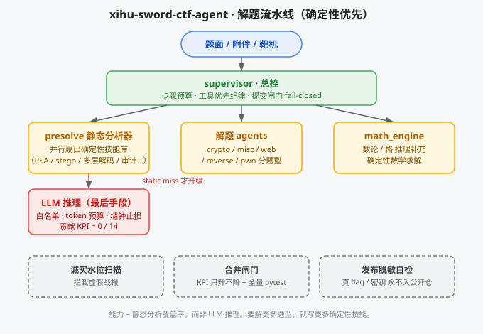

# xihu-sword-ctf-agent

> 🔧 **确定性优先的 CTF 智能体框架** — 先用 72 个可复现确定性技能横向爆破常见题型，LLM 仅在静态分析 miss 时才作为最后手段介入，且受白名单 / token 预算 / 墙钟止损三重约束。结果可复现、可调试、且**对自己能做什么诚实**。

> 🌏 **中文文档 / Chinese documentation**: [README.zh.md](./README.zh.md)

> ⚠️ **Honesty disclaimer (read first)**: This project's real-world competition result on the live platform was **0 accepted flags**. All "solved / pass-rate" figures in this repo refer to **offline deterministic analysis** of historical CTF problems (the `data/questions_real/` corpus), not any live contest score. We do not claim LLM autonomous reasoning capability — the real capability here is a **deterministic static analyzer (presolve)** covering common CTF categories. See [Honest KPI](#honest-kpi) below.

> 🔴 **口径更正 / Figure correction (2026-10-01)**: the "**LLM autonomous reasoning 1 / 2**" figure quoted in this README (from the 2026-09-22 clean-2 report) is **superseded and must not be cited as current truth**. The single problem behind that "1" — `real_crypto_dnui_keyboard` — was judged `solved_by=presolve` (78 ms, ≈0 tokens) in **two independent runs**: the 2026-09-29 full 17-problem pool, and the 2026-10-01 NYU stratified 5-problem trial (cold blackboard, E3 ON, deepseek). **The current verified count of LLM autonomous solves is 0.** Per project policy the original wording below is retained verbatim as a historical record of what was true at the time; this notice is what overrides it. Reminder: `2` is the *capability denominator*; the *runnable pool* (41 problems after the 2026-10-03 Google-CTF expansion) is a separate, harder set — never divide one by the other.

An open-source **AI agent framework for CTF (Capture The Flag)** competitions. The agent polls a DASCTF-style platform, triages challenges, runs deterministic solvers first, and only escalates to an LLM when static analysis misses. Built and battle-tested against the *West Lake Sword Tournament (西湖论剑)* AI CTF track.

---

> ℹ️ **Path convention**: Throughout this README, paths inside code spans are relative to `ctf_agent/`; markdown links are relative to this file.

## Why this exists

Most "CTF agents" are just an LLM with a shell. This one is the opposite: **deterministic-first**. A pre-solve layer (`core/presolve.py`) fans out dozens of ready-to-run skills (RSA attacks, stego extractors, source-code auditors, base64 multilayer decoders, …) in parallel. The LLM is a last-resort escalator, behind a whitelist, a token budget, and a wall-clock stop-loss. The result is a system that is **reproducible, debuggable, and honest about what it can and cannot do**.

## Architecture

```
ctf_agent/
├── core/          main loop, presolve static analyzer, supervisor agent, wall-clock stop-loss
├── agents/        per-category solvers (crypto_toolkit / misc / web / reverse / pwn …)
├── skills/        73 deterministic skills (run(params) -> dict interface; machine count = `scripts/_kpi_canonical.py`)
├── llm/           LLM client (provider whitelist, fail-closed circuit breaking)
├── ctfplatform/   contest-platform client (DASCTF-style), retry / fail-open submit path
├── sandbox/       code-execution sandbox (subprocess isolation)
├── eval/          historical-problem benchmark (honest KPI measurement)
├── data/questions_real/   historical problem corpus (most flags SHA-256; a few long-public events e.g. Anxun Cup 2020 retain plaintext; 2026 contest excluded)
├── config.py      config (defaults + environment-variable fallback)
├── run.py         entry point (--mode cli/web/mock)
└── setup.sh       environment bootstrap
```



### Solve pipeline

```
platform poll → triage/classify → attachment download + target probe
             → deterministic skills (73) ⇄ LLM reasoning (whitelisted providers)
             → flag validation → platform submit (fail-closed on request errors)
```

- **Supervisor architecture**: `core/main_agent.py` plans per challenge, `core/supervisor_agent.py` enforces step budgets, tool-first discipline, and the request-failure-vs-wrong-flag separation (the post-incident fix for a submit-circuit-breaker bug).
- **Deterministic-first**: `skills/` holds 73 runnable skills (`scripts/_kpi_canonical.py` machine count). `core/presolve.py` runs them before any LLM token is spent.
- **Whitelisted LLM only** (contest rule §3); multi-source fallback with 401/402 circuit breaking, per-question token budgets, heavy-model upgrade policy.
- **Race harness**: `scripts/_race_start.py --compete` = first-blood scan → stable polling → final report, with a mandatory e2e data-link preflight (fail-closed).

## Hard gates (lessons, codified)

| Gate | What | Enforced by |
|------|------|-------------|
| Test gate | real `pytest` run, no per-file fake loops | `setup.sh` (exit 1 on failure) |
| E2E gate | platform actually serves challenge data | `scripts/_e2e_verify.py`, wired into `--compete` |
| Network gate | proxy alive / LLM endpoints reachable | `scripts/_net_check.py` (`trust_env=False`) |
| Secret gate | no plaintext keys in staged files | pre-commit hook (`scripts/_scan_secrets.py`) |
| Write-lease gate | one writer per scope; out-of-scope commits rejected | `scripts/_lease.py` + pre-commit |

## Quick start

```bash
cd ctf_agent
bash setup.sh                      # venv + deps + whitelist + net check + test gate
export CTF_AGENT_LLM_PROVIDER=deepseek
export CTF_AGENT_LIGHT_MODEL=deepseek-chat
export DEEPSEEK_API_KEY=sk-xxx     # your key — never commit it
.venv/Scripts/python.exe run.py --mode mock --category crypto   # offline smoke test
.venv/Scripts/python.exe run.py --mode cli                      # local practice
```

Configuration is environment-variable driven (see `config.py`): `DASCTF_TOKEN`, `DASCTF_BASE_URL`, provider API keys. **Never commit keys** — the hook refuses.

## Honest KPI

The single machine-enforced KPI is **`offline_verified`** — the number of *historical real problems* for which a complete, reproducible attack chain produced a flag matching the problem's ground-truth `flag_sha256` (see `REAL_SOLVES_LEDGER.md`, guarded by the merge-gate ratchet in `scripts/_merge_gate.py` so it can only go up, never down).

| Metric | Result |
|--------|--------|
| **offline_verified** (strict real-problem KPI) | **14** |
| Deterministic pipeline coverage (presolve direct-solve) | **14 / 93** full-corpus (15.1%) (presolve direct-solve coverage — NOT a "solved" claim; full 93-problem corpus coverage tracked in REAL_SOLVES_LEDGER.md; `real_misc_vnctf_flag` 2026-09-03 governance fix —题面 `flag_pattern` 修订 + vision LLM 兜底链路修复后正式入 presolve) |
| LLM autonomous-reasoning contribution | **0 / 14** (all 14 verified solves are deterministic presolve/tooling; zero LLM reasoning) |
| Regression-set reproducible count | **16 / 16** (13 题严格 KPI 集 + 10732/10735 治理修复：`scripts/verify_10732.py` + `verify_10735.py` + `verify_specialcurve2.py` 可机器复现攻击链；REGRESSION_CHECKS 16 道全过；10732/10735 **不进** PROMOTION_EVIDENCE 因题面无官方 sha256 真值闭环；specialcurve2 **有**题面官方 flag_sha256 闭环，经 PROMOTION_EVIDENCE 带证据晋级 12→13，详见台账题块 1/2 + `scripts/_antifraud.py`) |
| **held-out reasoning pool** (unseen, non-trivial) | **2 problems** — disjoint from the 14 KPI solves (post-cleanup: 7 WRITEUP-reconstructed + 1 source-leaked web challenge excluded; the prior "10" mixed those in) |
| LLM reasoning on the held-out pool (measured 2026-09-22, clean 2-problem pool) | pool **2 / 2** solved — **LLM autonomous reasoning 1 / 2** (`real_crypto_dnui_keyboard`, sha256-verified) and **deterministic presolve 1 / 2** (`real_reverse_js`); both disjoint from the 14 KPI solves |

> **Why we never divide 14 by 2.** The 14 KPI solves and the 2 held-out problems are **disjoint sets**. `14 / 2 = 700%` would be a *deceptive ratio*, so our tooling hard-codes `coverage_of_heldout=None` instead of emitting a number. The held-out yardstick measures a *separate* thing — genuine autonomous LLM reasoning on unseen problems — not a fraction of the 14. Under the clean held-out yardstick (measured 2026-09-22, deepseek + E3 evidence injection; raw report archived in `ctf_agent/heldout_evidence/benchmark_report_clean2_20260922_deepseek.json`), **LLM autonomous reasoning = 1 / 2** (`real_crypto_dnui_keyboard`; the other, `real_reverse_js`, is solved by the deterministic pre-solve layer). The earlier "LLM 0 / 10" figure was an artifact of **two bugs now fixed**: (1) `bug2` — the verifier checked correct flags against a retired mixed-set answer table and rejected them as hallucinations (so genuine LLM solves scored as failures); (2) the held-out denominator was contaminated by 7 WRITEUP-reconstructed questions (flags verbatim in attachments) plus 1 source-leaked web challenge (`real_web_gongye_web2`, flag in its provided `index.php`). After excluding all contamination, the honest LLM autonomous-reasoning rate on the genuinely-unseen pool is **1 / 2** — a small sample (pool expansion is the open task).

> ⚠️ **What `offline_verified=14` does and does NOT mean.** It is the count of *real past-CTF problems* (provenance=`real_past_ctf`, sha256-verified, machine-counted by `scripts/_merge_gate.py count_offline_verified`) solved by a **reproducible deterministic pipeline** — a real engineering milestone, but **NOT a capability measurement**. These problems' writeups are public and almost certainly in LLM pre-training corpora (contamination risk — see `data/results/CTF-Agent深度评审报告_20260828.md` G1). LLM autonomous-reasoning contribution is **0/14**. Treat 14 as "template coverage of memorizable public problems," never as "reasoning ability." (Note: on 2026-08-28 the KPI was honestly cut back from a nominal 12 to 9 because three solves — `real_crypto_ezrsa`, `real_crypto_simplelegendre`, `real_crypto_exciting_inverse` — were not reproducible by the deterministic pipeline. All three were promoted **back into the strict KPI on 2026-09-03 with evidence**, each via a deterministic solver wired into presolve and returning `REGRESS_PASS` with sha256 matching ground truth: `real_crypto_ezrsa` — Håstad broadcast solver `skills/crypto_hastad_broadcast.py` (`_try_hastad_broadcast`, e=17, CRT+iroot); `real_crypto_simplelegendre` — Legendre-symbol solver `skills/crypto_legendre_phi.py` (`_try_legendre_phi`, phi-leak factorization + per-bit `(c|p)=(-1)^bi`); `real_crypto_exciting_inverse` — phi+dual-modular-inverse solver `skills/crypto_modinv_factor.py` (`_try_modinv_factor`, CRT⟹`A·p+B·q=N+1`⟹quadratic-root factorization). This count is therefore fully evidence-backed, unlike the pre-rollback nominal 12 — and unlike the 2026-08-28 nominal 12 that the rollback exposed as unverified. See `PROMOTION_EVIDENCE` in `scripts/_antifraud.py` and blocks 7/8/11 of `REAL_SOLVES_LEDGER.md`.) **2026-09-03 governance fix (no KPI change)**: `real_misc_vnctf_flag` was historically ledgered as A-class ✅ but the problem JSON had `flag_pattern` written as `flag\{[^}]+\}` while the true flag is `vnctf\{...\}` — presolve's secondary regex check misclassified the skill's sha256-verified output as "bait" and dropped it. Fixed the pattern, repaired the venv's broken `certifi` (force-reinstalled `certifi==2026.7.22` because RECORD file was missing, blocking `httpx` from finding the CA bundle), and confirmed `scripts/_regress_one.py real_misc_vnctf_flag` → `REGRESS_PASS (5159ms)` via the existing `skills/misc_grid_resample.py` (grid-resample deterministic algorithm + baidu `ernie-4.5-turbo-vl` vision-LLM OCR fallback, sha256-gated return). The solve was already counted in the 9-baseline `BASE_AUTHORIZED_KPI_SOLVES`; this fix moves it from "fake-reproducible-but-counted" to "genuinely-reproducible-and-counted", closes the `KNOWN_GAP` entry, and grows the machine-rerun regression set from 11 → 12.

> **LLM reasoning break-ice experiment (not counted in KPI, read the caveat)**: With `scripts/_llm_breaking_ice.py --no-internal-presolve` (presolve shortcuts disabled, LLM forced to reason), **`11/15`** historical problems were solved by `main_agent_llm` autonomous reasoning on baidu Qianfan ERNIE (crypto×7 / reverse×3 / web×1; all 11 have `sha256_ok=true` and `validated=true` against the problem ground truth — disk truth `deliverables/benchmark_runs/llm_breaking_ice_20260901-050201.json`). Earlier runs: `8/15` (2026-08-28, `llm_breaking_ice_20260828-022534.json`) is **superseded** by the 2026-09-01 run; an even earlier `10/15` count included two reverse solves whose sha256 did not match and was corrected.
>
> **Denominator caveat (do not conflate):** the `15` in `11/15` and `8/15` is *this experiment's own* problem set — it is **unrelated** to the deprecated presolve-coverage "15-problem subset" caliber (`15/15` / 86.7%) mentioned above, even though both happen to show the number 15. This experiment is **not counted in the KPI**; `11/15` is traceable to `deliverables/benchmark_runs/llm_breaking_ice_20260901-050201.json` and `8/15` to `llm_breaking_ice_20260828-022534.json` (superseded by the 2026-09-01 run).
>
> ⚠️ **Honesty caveat on the 4 unsolved (updated 2026-09-13):** the original report labeled them "3×TIMEOUT + 1×wrong_direction." This conflates **infrastructure failure with reasoning failure** and is itself a metric-integrity bug — the benchmark never serialized reasoning `steps`, so a TIMEOUT at exactly 240 s with 0 steps most likely means *the first LLM call never returned* (no credential / API hang / network death), **not** "the model can't reason." Per the user's strict-honesty requirement, `scripts/_llm_breaking_ice.py` now (a) pre-checks credentials and labels runs with no key as `INFRA_NO_CREDENTIAL` — never counted as reasoning failure; (b) persists `steps`; (c) tags TIMEOUT with `timeout_cause="api_hang_or_no_first_response_suspected"`. **Therefore the 11/15 figure must NOT be cited as "LLM can solve 11/15"** — it is "11 solved in one run where credentials were present; 4 inconclusive (timeout cause unverified)." The only strictly-honest LLM-reasoning statement remains: **LLM autonomous-reasoning contribution to the KPI is 0/14** (no LLM-only solve is in the strict sha256-verified KPI set). Details in `MEMORY.md`.

Interpretation: **capability = static-analyzer coverage**, not LLM reasoning. To solve more problem types, write more deterministic skills. We say this plainly because over-claiming is the easiest way to embarrass an open-source security tool.

## Known limitations

We publish these because they are **structural**, not because they are modest.

1. **This measures static-analysis coverage, not reasoning.** Every solve in the strict KPI (`offline_verified`) comes from the deterministic pre-solve layer. The KPI contains **no web solve and no pwn solve** — those categories usually require live target interaction or dynamic debugging, which an offline deterministic analyzer does not do. That is a design boundary, not a backlog item.

2. **The corpus and the capability point in different directions.** `misc` is the single largest category in the corpus, but verified deterministic coverage concentrates in `crypto` and `reverse`. We do not write one solver per problem, so this gap cannot be closed by tuning — it closes only by adding deterministic skills.

3. **The held-out measurement is real, but far too small to extrapolate.** The held-out ability denominator is currently **2 problems**. In that run the pool scored 2/2 — one solve from the deterministic pre-solve layer and **one** from LLM autonomous reasoning. We report the LLM number because it is what happened, and we refuse to inflate it: **1 of 2 is not a capability claim.** Our own sample ladder requires 8 → 12 → 20 → 30 → 60 before a result may be extrapolated; at 2 samples this is a data point, not a conclusion. It is also a **single run that we have not repeated** — an earlier run of the same problem did not solve it — so we do not claim it reproduces.

4. **Two held-out numbers exist; do not divide one by the other.** `2` is the ability denominator. `41` is the *runnable* pool (wider sourcing, harder problems) and is a candidate pool for expansion, **not** a denominator. Our tooling emits `coverage_of_heldout = None` rather than produce a ratio between two non-comparable sets.

5. **Everything here is offline.** All "solved" figures describe offline deterministic analysis of historical problems, never a live-contest score — our real contest result was **0 accepted flags**.

> Sources (reproduce yourself): `python scripts/_kpi_canonical.py` (offline_verified / real_corpus / heldout_candidates / heldout_runnable_pool); `scripts/_antifraud.py` (`BASE_AUTHORIZED_KPI_SOLVES` ∪ `PROMOTION_EVIDENCE` = the strict-KPI whitelist); `ctf_agent/heldout_evidence/benchmark_report_clean2_20260922_deepseek.json` (`mode=real_main_agent`).

> **Full post-mortem (Chinese, unabridged):** the [14 original retrospective documents](deliverables/复盘赛报/) — root-cause timeline, fix evidence, and the failures we have **not** fixed — are published in this repo as-is.

## Security & compliance

This repo publishes the **engineering skeleton and methodology only**. Red lines:

1. **Flags are handled per-event, honestly.** The large majority of historical-contest flags are stored as SHA-256. A small number of entries from long-public events (e.g. Anxun Cup 2020, whose write-ups are already public) retain plaintext flags. **Flags and attachments for the 2026 West Lake Sword contest itself are NOT included in this repo** (excluded via `.gitignore`). The strict-KPI ground truth (`flag_sha256`) is **not** hidden: it ships inside the tracked problem JSONs under `data/questions_real/**` (un-ignored via `!data/questions_real/**` in `ctf_agent/.gitignore`); only the raw plaintext `flag.txt` / `flag.png` / `*_attachments/` are gitignored.
2. **No secrets in the repo.** LLM keys and platform tokens are injected via env vars / registry only.
3. **Internal contest resources are excluded** (`data/race_details/`, attachments, signatures) via `.gitignore`.
4. **Honest water-level.** We do not exaggerate capability. See above.

## Project status

We publish this repository while stating its numbers plainly, including the ones that are unflattering. The strict KPI is **14 solved with full evidence** out of **93 collected real problems** (≈**15.1%**), where "solved" means a deterministic, re-runnable solver produces the flag and it matches the problem statement's SHA-256 — the LLM contributes **0 of 14**. On the **clean held-out pool** (2 unseen, non-trivial problems after excluding 7 WRITEUP-reconstructed + 1 source-leaked web challenge, disjoint from the 14), the LLM solved **1 of 2** by autonomous reasoning (`real_crypto_dnui_keyboard`, sha256-verified) in a real run (deepseek, ~7k tokens); the other (`real_reverse_js`) was solved by the deterministic pre-solve layer. The prior "0 of 10" was an artifact of a verifier bug (bug2, which rejected correct flags as hallucinations) and a contaminated denominator, now corrected. `14/2` is never computed.

> ⚠️ **Two different held-out scopes — do not conflate them.** Besides the **2-problem capability denominator** above, the repository also contains a **41-problem runnable pool** (2 in-house + 39 sourced from Google CTF 2021–2025). It is a **candidate for pool expansion, not a capability denominator**. That pool is substantially harder (measured per-problem token cost is roughly ~50× the clean pool); the problems sampled from it under a 100K-tokens-per-problem cap were **all unsolved**, and their reports are machine-flagged `integrity.interpretable=false` — i.e. they **must not** be quoted as a capability rate. Presenting `0/17` or `1/17` as a capability figure would mean describing "the problems are harder" as "the model is weaker": a deceptive ratio. `scripts/_kpi_canonical.py` emits the two scopes separately as `heldout_candidates` (=2, capability denominator) and `heldout_runnable_pool` (=41, runnable pool).

All of the above rests on artifacts in this repository; you can re-run them yourself.

## License

[MIT](LICENSE) — open for learning and research. Respect each CTF's rules and platform terms.
