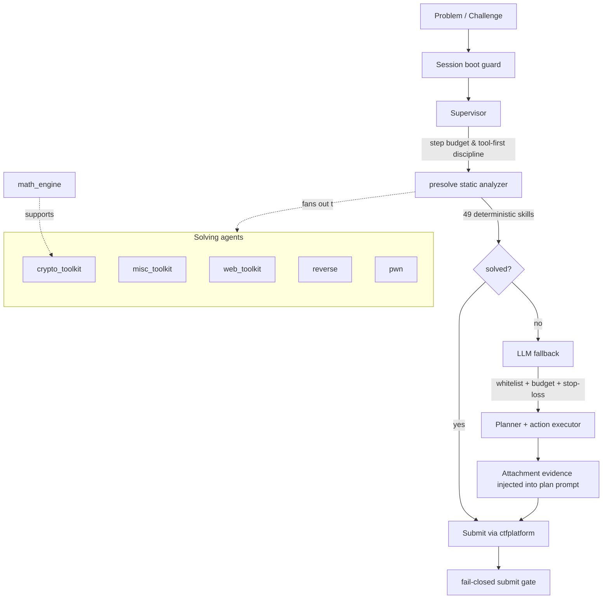

# Architecture

> **Design principle: deterministic-first.** A deterministic static-analysis
> layer (`presolve`) runs first and in parallel across 49 skills. LLM reasoning
> is used **only as a fallback** for problems the static layer misses, and only
> behind a provider whitelist, a token budget, and a wall-clock stop-loss.

## Component map

## Data flow

1. A challenge enters through `ctfplatform` (poller) or is loaded from
   `data/questions_real`.
2. The **supervisor** assigns a step budget and enforces tool-first discipline.
3. **presolve** fans out across the 49 skills. If a skill produces a flag, it is
   submitted directly — no LLM involved.
4. Only unsolved challenges escalate to the **LLM fallback**, which plans actions
   and uses the action executor. File-analysis evidence is accumulated and
   re-injected into the planner prompt (the "E3" evidence-injection pass).
5. Submissions go through a **fail-closed gate**: any request error hard-fails.

## Why this shape

Most CTF categories (RSA attacks, stego extraction, source review, multi-layer
encoding) are enumerable deterministic patterns. Handing them to a hallucination-
prone LLM first makes results non-reproducible and unauditable. Pushing the
deterministic layer to the front makes the system **reproducible, auditable, and
honest about its water level**.

## Honest KPI口径

- KPI = real-link solves on `data/questions_real` (15 historical problems).
- `presolve` static-analysis hits are **not** counted as LLM reasoning.
- The public README states the LLM autonomous solve count honestly (currently 0
  on the real benchmark) — this is a feature, not a bug.
